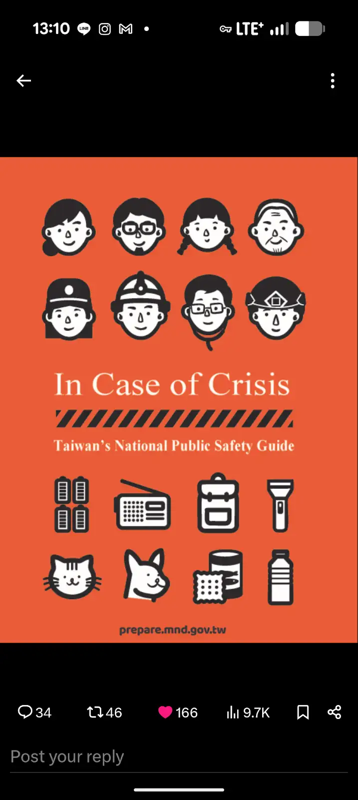

## 全民國防手冊

Apperently, the name of a github repo can only consist of ASCII characters, so, it's translated in English (as shown).

Prepare for it, in case you need it.

Also, do visit the official website [link](http://prepare.mnd.gov.tw/). [Mandarin pdf](https://prepare.mnd.gov.tw/assets/pdf/manual.pdf) [English pdf](https://prepare.mnd.gov.tw/assets/pdf/manual-en.pdf)

Turned out that there's a English version (cover below)

It's called **In Case of Crisis: Taiwan's National Public Safety Guide**

